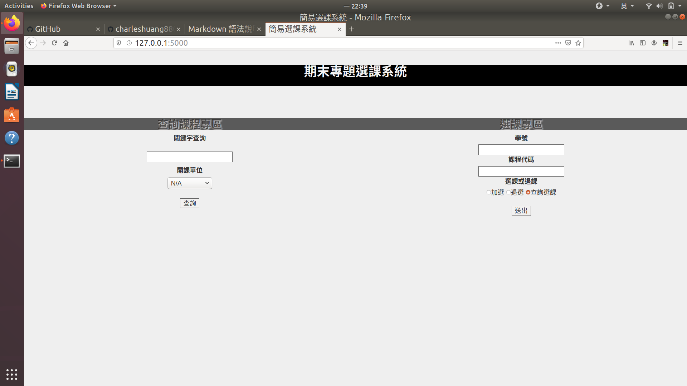
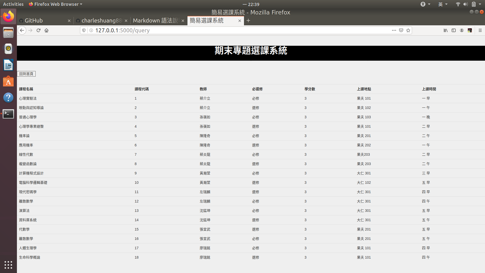

# DBMS2020-final-project

## Execute Virtual Environment on python venv module 
    python -m venv your_virtual_environment
    source ./venv/bin/activate   
    pip install flask flask-bootstrap
    python app.py  
## stop Virtual Environmnet
    deactivate  
    
## 期末資料庫專題

>>* 我們這組作的主題是 選課系統前端合簡易查詢選課系統
>>* 課程的要求實做 insert, update, delete and read 基本功能
>>* 這個系統基本實做了除了 update 以外的功能,因為當初設定的情境類似學校選課與查詢課程介面
>>* 後端維護資料的部份,對於修改內建資料庫的部份,並沒有多加著墨  

>>1. 簡易搜尋:以教師關鍵字和課程關鍵字還有系所為搜尋條件
>>2. 選課:以學生學號和課程代碼加入選課清單
>>3. 退課:跟選課類似,選課退課都只接受以在學生資料表裡的成員.
>>4. 查詢已選上紀錄.

>># 主要網頁介面: 首頁與查詢結果  

